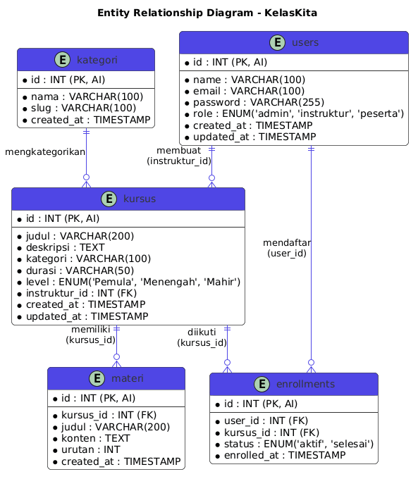

**Nama:** Andini Ayu Lestari
**NIM:** 25120100069


# KelasKita — Platform Kursus Online untuk Generasi Digital

> **Belajar skill baru, kapan saja, di mana saja.**


---

## Tentang KelasKita

**KelasKita** adalah platform kursus online yang memudahkan siapa saja untuk belajar skill digital secara mandiri. Di era transformasi digital ini, banyak pelajar dan fresh graduate yang kesulitan menemukan tempat belajar yang terjangkau, terstruktur, dan mudah diakses. KelasKita hadir sebagai solusinya.

---

## Masalah yang Diselesaikan

- Sulitnya akses konten belajar skill digital yang **terjangkau dan berkualitas**
- Tidak adanya platform belajar yang **terstruktur dan mudah dikelola**
- Pelajar kesulitan **memantau progress** belajar mereka
- Instruktur/admin kesulitan **mengelola data kursus dan peserta** secara efisien

---

## Target Pengguna

| Pengguna | Deskripsi |
|---|---|
| Pelajar & Mahasiswa | Ingin belajar skill digital tambahan di luar kampus |
| Fresh Graduate | Mempersiapkan diri masuk dunia kerja dengan skill relevan |
| Admin / Instruktur | Mengelola data kursus, materi, dan peserta |

---

## Fitur Prototipe

### Landing Page
- Navbar responsif dengan menu navigasi dan tombol Masuk
- Hero Section dengan headline dan tombol CTA
- Statistik: total kursus, peserta, dan instruktur
- 3 Kursus Unggulan dalam bentuk card grid
- Fitur Unggulan: Belajar Fleksibel, Instruktur Berpengalaman, Sertifikat Resmi
- Testimoni pengguna
- Footer dengan informasi startup

### Autentikasi
- Login dengan username dan password
- Session management (halaman dashboard terlindungi)
- Fitur logout

### Manajemen Kursus (CRUD)
- **Create** — Tambah kursus baru (judul, deskripsi, kategori, instruktur, durasi, level)
- **Read** — Lihat daftar semua kursus yang tersedia
- **Update** — Edit informasi kursus
- **Delete** — Hapus kursus yang sudah tidak aktif

### Interaktivitas JavaScript (DOM)
- Search/filter kursus realtime berdasarkan judul
- Counter peserta bertambah saat tombol "Daftar" diklik
- Konfirmasi dialog sebelum menghapus kursus
- Notifikasi toast saat aksi berhasil dilakukan

---

## Halaman Aplikasi

| URL | Halaman | Akses |
|---|---|---|
| `/` | Landing Page | Publik |
| `/login` | Halaman Login | Publik |
| `/dashboard` | Dashboard Admin | Login |
| `/kursus/create` | Form Tambah Kursus | Login |
| `/kursus/edit/:id` | Form Edit Kursus | Login |

---

## Arsitektur Aplikasi

Aplikasi ini dibangun menggunakan framework **CodeIgniter 4** dengan pola arsitektur **MVC (Model-View-Controller)**:

```
KelasKita/
├── app/
│   ├── Controllers/
│   │   ├── Home.php             # Landing page
│   │   ├── Auth.php             # Login & logout
│   │   └── Dashboard.php        # CRUD & session guard
│   ├── Models/
│   │   └── ProductModel.php     # Data kursus dummy
│   └── Views/
│       ├── landing.php          # Landing page
│       ├── auth/
│       │   └── login.php
│       ├── kursus/
│       │   ├── index.php
│       │   ├── create.php
│       │   └── edit.php
│       └── layouts/
│           └── main.php
├── legacy_code/
│   └── spaghetti.php            # Kode lama (sudah di-refactor)
├── public/
├── erd_startup.png
└── README.md
```

---

## Entity Relationship Diagram (ERD)

Berikut adalah rancangan struktur database **KelasKita** untuk persiapan scale-up:





### Relasi Antar Tabel
- **Users** `1` → `N` **Enrollments** — satu user bisa daftar banyak kursus
- **Kursus** `1` → `N` **Enrollments** — satu kursus bisa diikuti banyak user
- **Kursus** `1` → `N` **Materi** — satu kursus memiliki banyak materi
- **Users** `1` → `N` **Kursus** — satu instruktur bisa membuat banyak kursus

---

## Teknologi yang Digunakan

| Teknologi | Kegunaan |
|---|---|
|  | Backend language |
|  | Framework MVC |
|  | Struktur tampilan |
|  | UI responsif |
|  | Interaktivitas & DOM |
|  | Icon library |

---

## Cara Menjalankan

```bash
# 1. Clone repository
git clone https://github.com/UploadMyProject/bwd-mid-starter-kit.git

# 2. Masuk ke folder project
cd bwd-mid-starter-kit

# 3. Install dependencies
composer install

# 4. Salin file environment
cp env .env

# 5. Edit .env — sesuaikan base URL
# app.baseURL = 'http://localhost:8080/'

# 6. Jalankan server
php spark serve
```

Akses aplikasi di: `http://localhost:8080`

---

## Akun Demo

| Role | Username | Password |
|---|---|---|
| Admin | `admin` | `admin123` |

---

## Lembar Jawaban

**Nama:** Andini Ayu Lestari

**NIM:** 25120100069

### Profil Startup
- **Nama Startup:** KelasKita
- **Problem:** Sulitnya akses platform belajar skill digital yang terjangkau dan terstruktur
- **Target Pengguna:** Pelajar, mahasiswa, dan fresh graduate

### Penjelasan Fitur JavaScript (DOM)
Fitur interaktivitas yang dibuat:
1. **Search realtime** — filter tabel kursus berdasarkan judul tanpa reload halaman
2. **Counter peserta** — jumlah peserta bertambah +1 saat tombol "Daftar" diklik
3. **Konfirmasi hapus** — dialog konfirmasi muncul sebelum data dihapus
4. **Toast notifikasi** — notifikasi muncul di pojok kanan bawah saat aksi berhasil

### Refleksi Refactoring
Memisahkan kode ke MVC membuat aplikasi lebih **terstruktur, mudah dibaca, dan mudah dikembangkan**. Berbeda dengan `spaghetti.php` yang mencampur semua logika dalam satu file sehingga sulit di-maintain dan rawan bug. Dengan MVC, setiap bagian memiliki tanggung jawab yang jelas: Model mengelola data, View menampilkan UI, dan Controller mengatur alur logika bisnis.

---

## Developer

Dibuat sebagai prototipe UTS Mata Kuliah **Basic Web Development**
Universitas Cakrawala — T.A. 2025/2026

